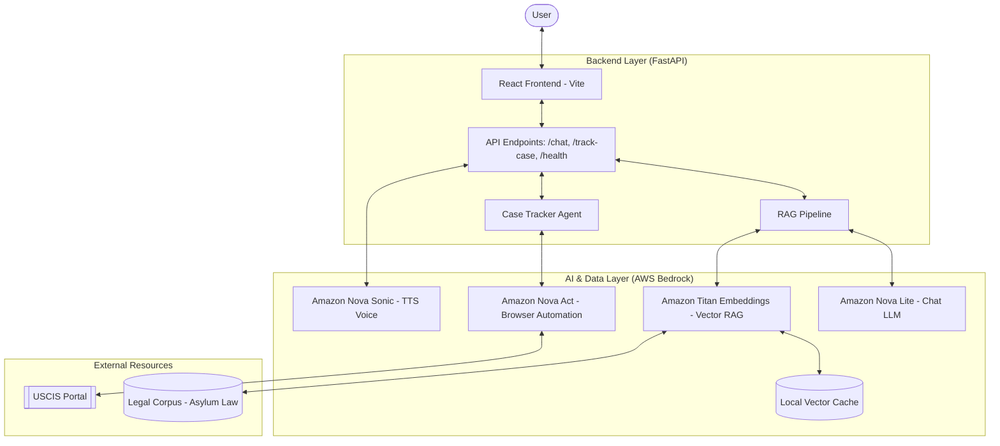
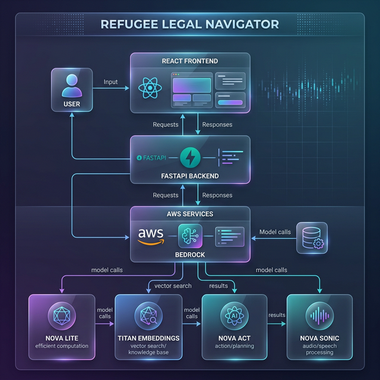

# 🌍 Refugee Legal Navigator

> AI-powered legal assistant helping asylum seekers understand their rights, track their cases, and navigate immigration law — in their own language.

[](https://mmypaeyi9d.us-east-1.awsapprunner.com/)
[](https://aws.amazon.com/ai/generative-ai/nova/)
[](LICENSE)


---

## 💡 Inspiration

A mother fleeing violence arrives at the border with her two children. She doesn't speak English. She doesn't understand asylum law.

**Here's what the data says:** Detained asylum seekers with legal representation are **five times more likely** to win their cases. Yet most face the system alone.

Every year, hundreds of thousands navigate complex refugee law without representation. They lose not because their cases lack merit — but because they lack access to clear, understandable guidance in their own language.

Refugee Legal Navigator was built to close that gap.

---

## ✨ What It Does

Refugee Legal Navigator is a full-stack AI legal assistant with four core capabilities:

### 🗣️ Multilingual Legal Chat

Ask legal questions in **12+ languages** — Arabic, Dari, Tigrinya, Swahili, Yoruba, Igbo, French, Spanish, and more. Powered by Amazon Nova Lite with RAG-grounded responses anchored in real asylum law.

### 📋 Automated Case Tracking

Paste your USCIS receipt number, and **Amazon Nova Act** autonomously navigates the USCIS portal to retrieve your current case status — no manual searching required.

### 🎙️ Voice Input & Output

Speak your questions and hear answers read back to you. Powered by **Amazon Nova Sonic**, this is critical for refugees with limited literacy or who are more comfortable speaking than typing.

### 📚 RAG-Grounded Legal Advice

All responses are anchored in **50+ chunks of real asylum law** — the 1951 Refugee Convention, US asylum statutes (INA §208), UNHCR guidelines, and country-specific procedures. Not just a chatbot wrapper — substantive, citation-aware legal guidance.

### 🎬 Director Mode

A built-in automated demo system that showcases all features with synchronized narration, typing animations, and real-time UI interactions — perfect for presentations and demos.

---

## 🏗️ Architecture

### System Flow (Mermaid)



### High-Level Architecture
- **Architecture Diagram**: 

---

## 🛠️ Tech Stack

| Layer              | Technology                                                  | Purpose                                            |
| ------------------ | ----------------------------------------------------------- | -------------------------------------------------- |
| **LLM**            | Amazon Nova Lite (`amazon.nova-lite-v1:0`)                  | Legal reasoning, multilingual chat responses       |
| **Embeddings**     | Amazon Titan Embed Text v2 (`amazon.titan-embed-text-v2:0`) | RAG vector embeddings with disk caching            |
| **Automation**     | Amazon Nova Act                                             | USCIS portal browser automation for case tracking  |
| **Voice**          | Amazon Nova Sonic                                           | Text-to-speech for multilingual audio output       |
| **Backend**        | Python, FastAPI, Uvicorn                                    | REST API, RAG pipeline, background processing      |
| **Frontend**       | React, Vite, Framer Motion                                  | Responsive UI with animations and voice visualizer |
| **Deployment**     | AWS App Runner                                              | Managed container deployment from GitHub source    |
| **Infrastructure** | AWS Bedrock, boto3                                          | AI model access and AWS service integration        |

---

## 📂 Project Structure

```
refugee-legal-navigator/
├── api_server.py          # FastAPI backend — routes, RAG pipeline, chat endpoint
├── start.py               # Cloud startup script (sys.path bootstrapper)
├── apprunner.yaml          # AWS App Runner deployment config
├── requirements.txt        # Python dependencies
├── src/
│   ├── agents/
│   │   └── case_tracker_agent.py   # Nova Act USCIS automation
│   ├── models/
│   │   └── legal_reasoning.py      # Legal analysis pipeline
│   └── utils/
│       └── nova_integration.py     # Nova Lite & Titan client wrappers
├── webapp/
│   ├── src/
│   │   ├── App.jsx                 # Main React application
│   │   └── components/
│   │       └── DirectorMode.jsx    # Automated demo system
│   └── dist/                       # Pre-built production frontend
├── data/
│   ├── legal_docs/                 # Asylum law corpus (RAG source)
│   └── embedding_cache.json        # Cached Titan embeddings
├── tests/                          # Unit tests
└── scripts/                        # Demo and utility scripts
```

---

## 🚀 Getting Started

### Prerequisites

- Python 3.11+
- Node.js 18+ (for frontend development)
- AWS account with Bedrock access (Nova Lite, Titan Embed, Nova Act)

### Local Development

```bash
# 1. Clone the repository
git clone https://github.com/YOUR_USERNAME/refugee-legal-navigator.git
cd refugee-legal-navigator

# 2. Create and activate virtual environment
python -m venv venv
source venv/bin/activate  # On Windows: .\venv\Scripts\activate

# 3. Install Python dependencies
pip install -r requirements.txt

# 4. Configure AWS credentials
export AWS_ACCESS_KEY_ID=your_key
export AWS_SECRET_ACCESS_KEY=your_secret
export AWS_DEFAULT_REGION=us-east-1

# 5. Start the backend
python -m uvicorn api_server:app --host 0.0.0.0 --port 8000

# 6. (Optional) Start frontend dev server
cd webapp
npm install
npm run dev -- --port 5173
```

The app will be available at `http://localhost:5173` (dev) or `http://localhost:8000` (API + pre-built frontend).

### Production Deployment (AWS App Runner)

The app is configured for automatic deployment via AWS App Runner:

```yaml
# apprunner.yaml
version: 1.0
runtime: python311
build:
  commands:
    build:
      - python3 -m pip install -r requirements.txt -t /app/deps
      - PYTHONPATH=/app/deps python3 -m playwright install chromium
run:
  command: python3 start.py
  network:
    port: 8000
```

Simply connect your GitHub repository to an App Runner service and it will auto-deploy on every push.

---

## 🌐 Supported Languages

| Language | Code | Native Name |
| -------- | ---- | ----------- |
| English  | `en` | English     |
| Arabic   | `ar` | العربية     |
| French   | `fr` | Français    |
| Spanish  | `es` | Español     |
| Swahili  | `sw` | Kiswahili   |
| Dari     | `fa` | دری         |
| Tigrinya | `ti` | ትግርኛ        |
| Somali   | `so` | Soomaali    |
| Pashto   | `ps` | پښتو        |
| Hausa    | `ha` | Hausa       |
| Igbo     | `ig` | Igbo        |
| Yoruba   | `yo` | Yorùbá      |

> [!NOTE]
> **Cultural Focus**: The addition of **Igbo** and **Yoruba** support was a deliberate decision to better serve the West African refugee community, ensuring they have equitable access to legal navigator resources in their native tongues.

---

## 🧠 How the RAG Pipeline Works

1. **Document Ingestion** — Legal documents (asylum statutes, UNHCR guidelines, convention articles) are chunked into ~500-token segments
2. **Embedding** — Each chunk is embedded using Amazon Titan Embed Text v2 (`amazon.titan-embed-text-v2:0`) with 1024-dimensional vectors
3. **Caching** — Embeddings are cached to disk (`embedding_cache.json`) for instant startup on subsequent runs
4. **Query** — User questions are embedded in real-time, and the top-k most similar chunks are retrieved via cosine similarity
5. **Augmented Generation** — Retrieved legal context is injected into the Nova Lite prompt, grounding all responses in actual law
6. **Fallback** — If Titan embeddings are unavailable, a keyword-based BM25-style fallback ensures the system never fails silently

---

## 🏆 Challenges & Solutions

| Challenge                 | What Happened                                                                                                   | How We Solved It                                                    |
| ------------------------- | --------------------------------------------------------------------------------------------------------------- | ------------------------------------------------------------------- |
| **Package Loss**          | App Runner's multi-stage Docker build silently discards `pip install` packages during `COPY --from=build-stage` | Install to `/app/deps` with `pip install -t /app/deps`              |
| **NameError Crash**       | Route refactoring left variable references before their definitions — instant crash                             | Moved `BASE_DIR` to top of file, removed orphaned code blocks       |
| **Shell Wrapper Failure** | `sh -c "export PYTHONPATH=... && python3 -m uvicorn ..."` failed silently in App Runner's exec                  | Created `start.py` to handle `sys.path` natively in Python          |
| **Frontend API URL**      | React app hardcoded to `http://localhost:8000` — doesn't work in production                                     | Conditional URL: relative in production, localhost in dev           |
| **Route Shadowing**       | SPA catch-all route `/{path}` intercepted API endpoints                                                         | Defined API routes before the catch-all, added `/api/` prefix check |
| **Health Check Timeout**  | Document loading blocked the event loop, causing health check failures                                          | Background task for document ingestion, instant health endpoint     |

---

## 📊 Key Design Decisions

- **Lazy Initialization** — AWS clients (`NovaClient`, `CaseTrackerAgent`) are created on first use, not at import time, preventing crashes in environments without credentials
- **Background Startup** — RAG document loading runs asynchronously so the health check passes immediately while embeddings load
- **Disk-Cached Embeddings** — Titan embedding calls are expensive; caching 50 chunks to JSON makes subsequent startups instant
- **Pre-built Frontend** — The React app is pre-built and committed to `webapp/dist/`, eliminating the need for Node.js in the production runtime
- **Thread Pool for Embeddings** — Blocking Titan API calls are offloaded to a `ThreadPoolExecutor` to avoid blocking the async event loop

---

## 🤝 Contributing

Contributions are welcome! Areas where help is especially needed:

- **Legal corpus expansion** — Adding asylum law from EU, UK, Canada, Australia
- **Language support** — Adding more refugee languages (Rohingya, Amharic, Kurdish)
- **Accessibility** — Screen reader support, high contrast mode, offline PWA
- **Testing** — Integration tests for the RAG pipeline and Nova Act automation

---

## 📬 What's Next

- 🌍 **Multi-country legal databases** — EU, UK, Canadian, and Australian refugee procedures
- 🤝 **Legal aid referrals** — Direct connections to pro bono immigration attorneys
- 📝 **Document preparation** — Guided I-589 asylum application workflows
- 📱 **Offline mode** — Downloadable version for refugees in camps or transit
- 📈 **Case outcome prediction** — Historical decision data for realistic expectations

---

## 📜 License

This project is open source and available under the [MIT License](LICENSE).

---

<p align="center">
  <strong>Built with ❤️ for the world's most vulnerable people</strong><br>
  <em>Powered by Amazon Nova AI</em>
</p>
