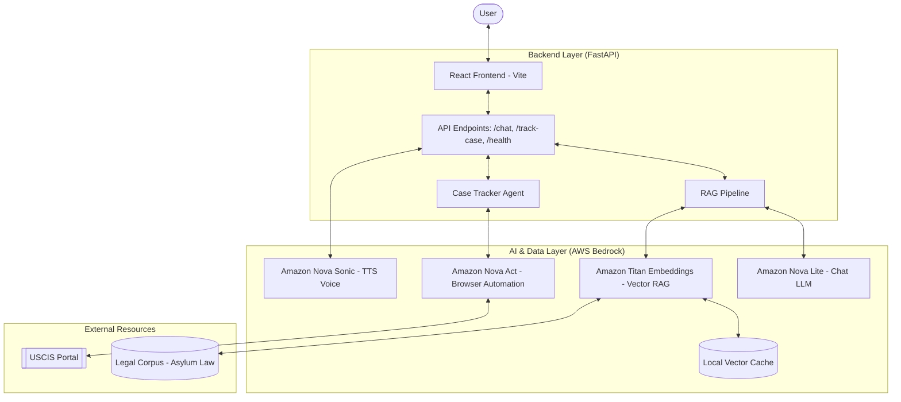

# 🌍 Refugee Legal Navigator - Devpost Submission

## 🎨 Architecture Diagram

### System Flow

### Visual Architecture
- **Architecture Diagram**: 

## 💡 Inspiration
Refugee Legal Navigator was built to help asylum seekers navigate complex legal systems using the power of generative AI. Detention centers and border crossings are often chaotic, and legal representation is scarce. This tool provides a first-line multilingual assistant to help people understand their rights and track their cases autonomously.

## ✨ What it does
- **Multilingual Legal Chat**: Powered by Amazon Nova Lite for 12+ languages.
- **Automated Case Tracking**: Leverages Amazon Nova Act for autonomous USCIS status retrieval.
- **Voice Capabilities**: Amazon Nova Sonic provides low-latency text-to-speech for accessibility.
- **RAG-Grounded Reasoning**: Anchored in 50+ chunks of real asylum law documents.

## 🛠️ How we built it
- **Frontend**: React with Vite, styled with Vanilla CSS and Framer Motion for a premium glassmorphic UI.
- **Backend**: FastAPI (Python) for high-performance async processing.
- **AI Infrastructure**: AWS Bedrock hosting the Amazon Nova family of models.
- **Deployment**: containerized with Docker and deployed on AWS App Runner.

## 🚀 Challenges we ran into
- **Browser Automation**: Configuring Playwright for Amazon Nova Act in a containerized environment.
- **Model Orchestration**: Synchronizing multiple Nova models (Lite, Act, Sonic) for a seamless user experience.
- **RAG Latency**: Optimizing vector search and context injection to keep chat responses snappy.

## 🏆 Accomplishments that we're proud of
- Successfully integrating the entire Amazon Nova suite (Lite, Act, Sonic) into one cohesive application.
- Building a highly accessible interface that supports voice interaction.
- Creating a robust RAG pipeline that handles complex legal terminology accurately.

## 📖 What we learned
- The power of "Small and Mighty" models like Nova Lite for specialized multilingual tasks.
- Advanced techniques for browser automation with LLMs (Nova Act).
- Best practices for deploying AI-native applications on AWS App Runner.

## 📬 What's next for Refugee Legal Navigator
- Expanding the legal corpus to include EU and UK asylum law.
- Integrating direct pro bono legal aid referrals.
- Developing an offline-first PWA for use in remote areas.
